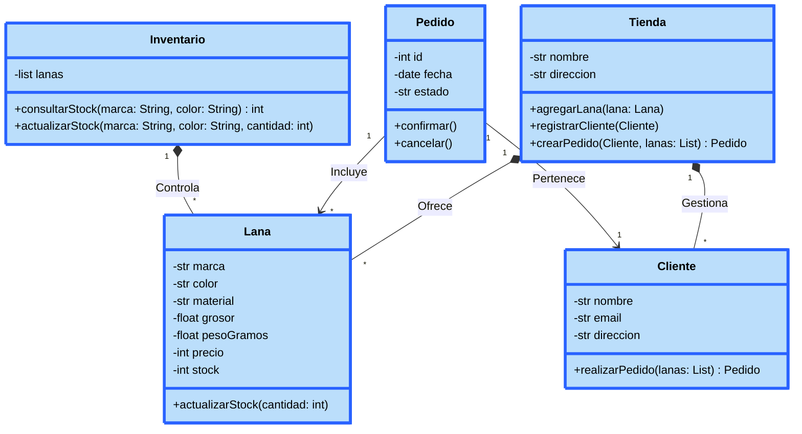

Desarrollo del reto 02: \
Elija un problema de la vida real (sistema de gestión de biblioteca, negocio de compra-venta, automóvil, etc) que se pueda modelar a través de objetos y clases. Plantee las relaciones de clases, composiciones, propiedades y comportamientos del sistema en uno más diagramas tipo UML.

Ejemplo Usado: Tienda de lanas. \
Este programa permite: \
-Registrar distintos tipos de lanas que heredan unas caracteristicas especificas.\
-Mantener un inventario del stock de lanas disponibles.\
-Agregar clientes que támbien heredan ciertas caracteristicas.\
-Gestionar los pedidos de lanas que los clientes hagan.

